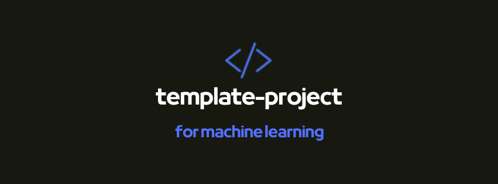

# template-project

<center>



</center>

<div align="center">
    <a href="https://github.com/psf/black">
        
    </a>
    
    
    <a href="https://github.com/psf/black">
        
    </a>
    <a href="https://github.com/PyCQA/flake8">
        
    </a>
    <a href="https://pycqa.github.io/isort">
        
    </a>
    <a href="https://github.com/python/mypy">
        
    </a>
</div>
<br />

VSCode × Pythonでの開発環境のテンプレート

## Used libraries

- python3.9
- VSCode(devcontainer.json, setting.json)
- docker
- poetry
- flake8
- black
- isort
- mypy
- mdformat
- pytest
- azure-pipelines
- mkdocs

## Environment

### dockerコンテナ ビルド & 起動

```bash
docker-compose up -d --build dev
```

### コンテナにアタッチ

VScode左下の`><`ボタンより`Open Folder in Container`でコンテナにアクセス

## Appendix

### 全般

<https://github.com/cvpaperchallenge/Ascender> \
<https://qiita.com/edge-m/items/846715217fc3dd481a84> \
<https://zenn.dev/zenizeni/books/a64578f98450c2> \
<https://zenn.dev/alivelimb/articles/20220501-python-env> \
<https://github.com/arrowkato/my_favorite_python_env> \
<https://zenn.dev/jdbtisk/articles/e6ed54b38b6a45> \
<https://qiita.com/ShortArrow/items/f29e4d0df7d836eec770>

### VScode 拡張機能

<https://qiita.com/yamaguchi2000/items/76060c08764ce4c704f9> \
<https://qiita.com/papi_tokei/items/c639dc7d1e0f5ad68a74> \
<https://qiita.com/nanato12/items/ddf26487eb30714251c3> \
<https://maasaablog.com/integrated-development-environment/visual-studio-code/923/>

### linter/formatter

<https://qiita.com/sin9270/items/85e2dab4c0144c79987d> \
<https://qiita.com/fehde/items/723b619013dc86008acc>

### mkdocs

<https://zenn.dev/mebiusbox/articles/81d977a72cee01> \
<https://timvink.github.io/mkdocs-print-site-plugin/>
